# Updated AI Trading System Flowchart - With Accuracy Optimization & Robust Error Handling

> **Update:**
> - All strategy outputs now include every required key (Description, Timeframe, Pros, Cons, When to Use, Suitable For, final_recommendation).
> - Robust error handling and fallback logic: UI and agents always display a default or fallback value if any key is missing.
> - Multi-agent consensus and fallback logic ensure the app never crashes due to missing data.
> - Professional reporting and PDF generation are now resilient to incomplete data.

```mermaid
flowchart TD
    %% USER & UI FLOW
    A([User opens dashboard]):::start --> B[Sidebar Configuration:<br/>• Ticker, dates, interval<br/>• Strategy & indicators<br/>• Vision analysis settings<br/>• Options priority toggle]:::ui
    B --> B1[📊 Accuracy Report Available<br/>Real-time metrics sidebar]:::accuracy
    B1 --> C([User clicks 'Fetch & Analyze Data']):::start
    C --> D[Enhanced Data Pipeline:<br/>• Market data + options<br/>• Technical indicators<br/>• Support/resistance levels<br/>• Data validation]:::process
    D --> E{Data loaded & validated?}:::decision
    E -- Yes --> F[Session state updated<br/>+ Quality assurance checks]:::process
    E -- No --> G[[Show error message]]:::error
    F --> H[Multi-Tab Analysis Interface:<br/>📈 Technical - 🤖 AI Analysis - 💰 Options]:::ui
    H --> I[Display Enhanced Metrics:<br/>• Price levels & ranges<br/>• IV rank & percentile<br/>• Market regime indicator<br/>• Fundamental data]:::ui
    H --> J[Vision-Optimized Chart Generation:<br/>• Deterministic themes<br/>• Metadata watermarking<br/>• WebP compression <250KB<br/>• Panel standardization]:::vision

    %% AI ANALYSIS FLOW - PHASE 1: PREPARATION
    H --> K([User clicks 'Run Analysis']):::start
    K --> K1{Vision Analysis Enabled?}:::decision
    K1 -- Yes --> K2[Configure Vision Timeout<br/>& Chart Optimization]:::vision
    K1 -- No --> K3[Skip Vision Processing]:::process
    K2 --> L[Create HedgeFundAI Instance<br/>• Load strategy database<br/>• Initialize 4 AI agents<br/>• Set risk limits]:::ai
    K3 --> L

    %% PHASE 2: REGIME DETECTION
    L --> L1[🔍 Market Regime Detection:<br/>• ADX trend strength<br/>• MA slope analysis<br/>• BB position & volatility<br/>• IV/RV ratio assessment<br/>• Earnings proximity check]:::regime
    L1 --> L2{Regime Classification}:::decision
    L2 -- Strong ADX + Slope --> L3[📈 TREND Regime<br/>70% Quant, 30% Vision]:::trend
    L2 -- Low ADX + Range --> L4[📊 RANGE Regime<br/>45% Quant, 55% Vision]:::range  
    L2 -- High IV/RV --> L5[📅 EVENT Regime<br/>60% Quant, 40% Vision]:::event

    %% PHASE 3: MULTI-AGENT ANALYSIS
    L3 --> M[Multi-Agent Hedge Fund Analysis]:::ai
    L4 --> M
    L5 --> M
    M --> M1[📊 AnalystAgent:<br/>Technical analysis & research]:::agent
    M1 --> M2[🎯 StrategyAgent:<br/>Strategy selection & optimization]:::agent
    M2 --> M3[⚡ ExecutionAgent:<br/>Entry/exit timing & risk mgmt]:::agent
    M3 --> M4[🧪 BacktestAgent:<br/>Performance validation]:::agent

    %% PHASE 4: CONSENSUS & FUSION  
    M4 --> N[Consensus Decision Engine:<br/>• 60% agreement threshold<br/>• Conflict resolution<br/>• Risk limit validation<br/>• Quality gate checks]:::consensus
    N --> N1{Consensus Reached?}:::decision
    N1 -- No --> N2[Conflict Resolution<br/>& Risk Override]:::consensus
    N1 -- Yes --> N3[✅ Hedge Fund Recommendation]:::consensus
    N2 --> N3
    
    %% PHASE 4.5: STRATEGY ARBITER & SCHEMA VALIDATION
    N3 --> SA[🏆 Strategy Arbiter:<br/>• Score candidate strategies<br/>• Filter by timeframe<br/>• Match with market regime<br/>• Select highest-scoring strategy]:::arbiter
    SA --> SV[📋 Schema Validation:<br/>• Validate against JSON schema<br/>• Check required fields<br/>• Verify data types]:::validation
    SV --> SV1{Schema Valid?}:::decision
    SV1 -- Yes --> SV2[✅ Use Original Output]:::validation
    SV1 -- No --> SV3[🔄 Data Adaptation:<br/>• Transform flat to nested structure<br/>• Handle null values<br/>• Add missing fields]:::adaptation
    SV3 --> SV4{Adaptation Success?}:::decision
    SV4 -- Yes --> SV5[✅ Use Adapted Output]:::validation
    SV4 -- No --> SV6[⚠️ Use Default Fallbacks]:::adaptation
    SV2 --> SV7[Final Validated Output]:::validation
    SV5 --> SV7
    SV6 --> SV7

    %% PHASE 5: VISION ANALYSIS (IF ENABLED)
    SV7 --> O1{Vision Analysis?}:::decision
    O1 -- No --> P1[Quantitative-Only Analysis]:::process
    O1 -- Yes --> O2[🎨 Vision-Optimized Chart<br/>Processing with AI Model]:::vision
    O2 --> O3[📋 Structured Schema Validation:<br/>• Pydantic model enforcement<br/>• JSON extraction + fallback<br/>• Price bounds validation<br/>• Confidence scoring]:::vision
    O3 --> O4{Vision Parsing Success?}:::decision
    O4 -- Yes --> O5[✅ Structured Vision Output]:::vision
    O4 -- No --> O6[⚠️ Fallback to Natural Language]:::vision
    O5 --> P2[🔗 Regime-Aware Fusion Engine]:::fusion
    O6 --> P2
    P1 --> P3[Skip Fusion - Use Quant Only]:::process

    %% PHASE 6: PROBABILITY FUSION & THRESHOLDS
    P2 --> P4[Intelligent Probability Fusion:<br/>• Dynamic regime weights<br/>• Confidence scaling<br/>• Calibration adjustments<br/>• Uncertainty propagation]:::fusion
    P4 --> P5[Decision Threshold Engine:<br/>• Regime-specific thresholds<br/>• No-trade zone enforcement<br/>• Minimum confidence gates<br/>• Risk-adjusted scoring]:::fusion
    P3 --> P5

    %% PHASE 7: STRATEGY OPTIMIZATION
    P5 --> Q{Options Priority Mode?}:::decision
    Q -- Yes --> Q1[🎯 Options Strategy Grid:<br/>• Strike/expiry optimization<br/>• Expected value calculation<br/>• Transaction cost modeling<br/>• Risk-adjusted metrics]:::options
    Q -- No --> Q2[📈 Stock Strategy Focus:<br/>• Buy/hold/sell signals<br/>• Stop-loss optimization<br/>• Position sizing]:::process
    Q1 --> R[Final Strategy Selection<br/>& Parameter Optimization]:::process
    Q2 --> R

    %% PHASE 8: PREDICTION LOGGING & DISPLAY
    R --> S[📊 Accuracy Metrics Logging:<br/>• Prediction context storage<br/>• Regime classification<br/>• Confidence levels<br/>• Market conditions<br/>• Strategy parameters]:::accuracy
    S --> T[🎯 Enhanced Results Display:<br/>• Professional trade report<br/>• Risk assessment<br/>• Market regime indicator<br/>• Confidence calibration<br/>• Action parameters]:::ui

    %% PHASE 9: REPORTING & ACTIONS
    T --> U{Generate PDF Report?}:::decision
    U -- Yes --> V[📄 Professional PDF Generation<br/>with comprehensive analysis]:::ui
    U -- No --> W[Continue Analysis]:::process
    V --> X[📈 Sidebar Accuracy Dashboard:<br/>• Real-time hit rates<br/>• Regime performance<br/>• Calibration metrics<br/>• Historical trends]:::accuracy
    W --> X

    %% PHASE 10: CONTINUOUS LEARNING
    X --> Y[⏰ Background Accuracy Tracking:<br/>• Outcome recording<br/>• Performance analysis<br/>• Model calibration<br/>• Threshold optimization]:::accuracy
    Y --> Z([Analysis Complete - System Ready for Next Iteration]):::start

    %% Styling
    classDef start fill:#ff9999,stroke:#333,stroke-width:2px,color:#000;
    classDef ui fill:#e6f2ff,stroke:#0066cc,stroke-width:1.5px,color:#000;
    classDef process fill:#fff2e6,stroke:#ff9900,stroke-width:1px,color:#000;
    classDef decision fill:#ffe4b5,stroke:#333,stroke-width:2px,color:#000;
    classDef ai fill:#e6ffe6,stroke:#009900,stroke-width:2px,color:#000;
    classDef agent fill:#bbf,stroke:#333,stroke-width:1.5px,color:#000;
    classDef regime fill:#f0e6ff,stroke:#9900cc,stroke-width:2px,color:#000;
    classDef trend fill:#e6ffcc,stroke:#66cc00,stroke-width:1.5px,color:#000;
    classDef range fill:#ccf2ff,stroke:#0099cc,stroke-width:1.5px,color:#000;
    classDef event fill:#ffcccc,stroke:#cc0000,stroke-width:1.5px,color:#000;
    classDef vision fill:#ffe6f2,stroke:#cc0066,stroke-width:1.5px,color:#000;
    classDef consensus fill:#e6e6ff,stroke:#6666cc,stroke-width:1.5px,color:#000;
    classDef fusion fill:#ffffe6,stroke:#cccc00,stroke-width:2px,color:#000;
    classDef options fill:#f2e6ff,stroke:#9933cc,stroke-width:1.5px,color:#000;
    classDef accuracy fill:#ccffcc,stroke:#00cc66,stroke-width:2px,color:#000;
    classDef arbiter fill:#d5f5e3,stroke:#1e8449,stroke-width:2px,color:#000;
    classDef validation fill:#fadbd8,stroke:#943126,stroke-width:1.5px,color:#000;
    classDef adaptation fill:#ebdef0,stroke:#8e44ad,stroke-width:1.5px,color:#000;
    classDef error fill:#ffcccc,stroke:#cc3333,stroke-width:1px,color:#000;

    %% Apply classes
    class A,C,K,Z start
    class B,H,I,J,T,V ui
    class D,F,K3,P1,P3,Q2,R,W process
    class E,K1,L2,N1,O1,O4,Q,U decision
    class L,M ai
    class M1,M2,M3,M4 agent
    class L1 regime
    class L3 trend
    class L4 range
    class L5 event
    class K2,O2,O3,O5,O6 vision
    class N,N2,N3 consensus
    class P2,P4,P5 fusion
    class Q1 options
    class B1,S,X,Y accuracy
    class G error
```

