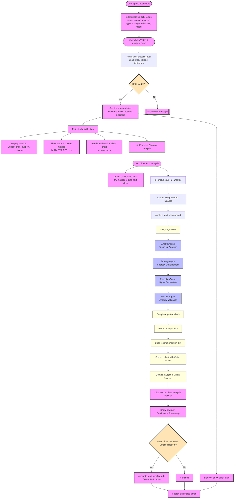

```mermaid
flowchart TD
    %% USER & UI FLOW
    A([User opens dashboard]):::start --> B[Sidebar: Select ticker, date range, interval, analysis type, strategy, indicators, model]
    B --> C([User clicks 'Fetch & Analyze Data'])
    C --> D[fetch_and_process_data<br/>Load price, options, indicators]
    D --> E{Data loaded?}
    E -- Yes --> F[Session state updated<br/>with data, levels, options, indicators]
    E -- No --> G[[Show error message]]
    F --> H[Main Analysis Section]
    H --> I[Display metrics:<br/>Current price, support, resistance]
    H --> J[Show stock & options metrics:<br/>IV, HV, VIX, EPS, etc.]
    H --> K[Render technical analysis chart<br/>with overlays]
    H --> L[AI-Powered Strategy Analysis]
    L --> M([User clicks 'Run Analysis'])
    M --> N[predict_next_day_close:<br/>ML model predicts next close]
    F --> U[Sidebar: Show quick stats]
    U --> V[Footer: Show disclaimer]
    T --> V
    S --> V

    %% AI ANALYSIS FLOW
    M --> N1[ai_analysis.run_ai_analysis]
    N1 --> N2[Create HedgeFundAI instance]
    N2 --> N3[analyze_and_recommend]
    N3 --> N4[analyze_market]
    N4 --> N5[AnalystAgent:<br/>Technical Analysis]
    N5 --> N6[StrategyAgent:<br/>Strategy Development]
    N6 --> N7[ExecutionAgent:<br/>Signal Generation]
    N7 --> N8[BacktestAgent:<br/>Strategy Validation]
    N8 --> N9[Compile Agent Analysis]
    N9 --> N10[Return analysis dict]
    N10 --> N11[Build recommendation dict]
    N11 --> N12[Process chart with Vision Model]
    N12 --> N13[Combine Agent & Vision Analysis]
    N13 --> O[Display Combined Analysis Results]
    O --> Q[Show Strategy, Confidence, Reasoning]
    Q --> R{User clicks 'Generate Detailed Report'?}
    R -- Yes --> S[generate_and_display_pdf:<br/>Create PDF report]
    R -- No --> T[Continue]

    %% Styling
    classDef start fill:#f9f,stroke:#333,stroke-width:2px;
    classDef agent fill:#bbf,stroke:#333,stroke-width:1.5px;
    classDef process fill:#ffd,stroke:#333,stroke-width:1px;
    classDef ui fill:#fff,stroke:#333,stroke-width:1px;
    classDef decision fill:#ffe4b5,stroke:#333,stroke-width:2px;

    class A,B,C,F,H,I,J,K,L,M,N,U,V,T,S,G,O,Q,R start
    class N5,N6,N7,N8 agent
    class N4,N9,N10,N11,N12,N13 process
    class E,R decision
```