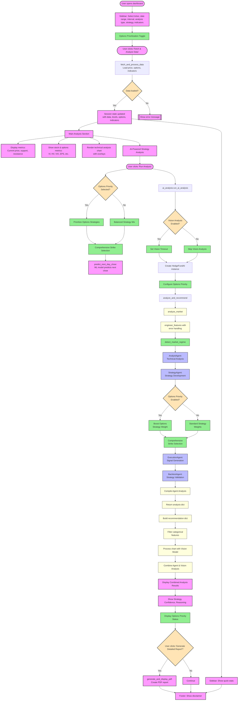

```mermaid
flowchart TD
    %% USER & UI FLOW
    A([User opens dashboard]):::start --> B[Sidebar: Select ticker, date range, interval, analysis type, strategy, indicators]
    B --> B1[Options Prioritization Toggle]:::new
    B1 --> C([User clicks 'Fetch & Analyze Data'])
    C --> D[fetch_and_process_data<br/>Load price, options, indicators]
    D --> E{Data loaded?}
    E -- Yes --> F[Session state updated<br/>with data, levels, options, indicators]
    E -- No --> G[[Show error message]]
    F --> H[Main Analysis Section]
    H --> I[Display metrics:<br/>Current price, support, resistance]
    H --> J[Show stock & options metrics:<br/>IV, HV, VIX, EPS, etc.]
    H --> K[Render technical analysis chart<br/>with overlays]
    H --> L[AI-Powered Strategy Analysis]
    L --> M([User clicks 'Run Analysis'])
    M --> M1{Options Priority<br/>Selected?}:::new
    M1 -- Yes --> M2[Prioritize Options Strategies]:::new
    M1 -- No --> M3[Balanced Strategy Mix]:::new
    M2 --> M4[Comprehensive Strike Selection]:::new
    M3 --> M4
    M4 --> N[predict_next_day_close:<br/>ML model predicts next close]
    F --> U[Sidebar: Show quick stats]
    U --> V[Footer: Show disclaimer]
    T --> V
    S --> V

    %% AI ANALYSIS FLOW
    M --> N1[ai_analysis.run_ai_analysis]
    N1 --> N1A{Vision Analysis<br/>Enabled?}:::new
    N1A -- Yes --> N1B[Set Vision Timeout]:::new
    N1A -- No --> N1C[Skip Vision Analysis]:::new
    N1B --> N2[Create HedgeFundAI instance]
    N1C --> N2
    N2 --> N2A[Configure Options Priority]:::new
    N2A --> N3[analyze_and_recommend]
    N3 --> N4[analyze_market]
    N4 --> N4A[engineer_features with<br/>error handling]:::new
    N4A --> N4B[detect_market_regime]:::new
    N4B --> N5[AnalystAgent:<br/>Technical Analysis]
    N5 --> N6[StrategyAgent:<br/>Strategy Development]
    N6 --> N6A{Options Priority<br/>Enabled?}:::new
    N6A -- Yes --> N6B[Boost Options<br/>Strategy Weight]:::new
    N6A -- No --> N6C[Standard Strategy<br/>Weights]:::new
    N6B --> N6D[Comprehensive<br/>Strike Selection]:::new
    N6C --> N6D
    N6D --> N7[ExecutionAgent:<br/>Signal Generation]
    N7 --> N8[BacktestAgent:<br/>Strategy Validation]
    N8 --> N9[Compile Agent Analysis]
    N9 --> N10[Return analysis dict]
    N10 --> N11[Build recommendation dict]
    N11 --> N11A[Filter categorical<br/>features]:::new
    N11A --> N12[Process chart with Vision Model]
    N12 --> N13[Combine Agent & Vision Analysis]
    N13 --> O[Display Combined Analysis Results]
    O --> Q[Show Strategy, Confidence, Reasoning]
    Q --> Q1[Display Options Priority<br/>Status]:::new
    Q1 --> R{User clicks 'Generate Detailed Report'?}
    R -- Yes --> S[generate_and_display_pdf:<br/>Create PDF report]
    R -- No --> T[Continue]

    %% Styling
    classDef start fill:#f9f,stroke:#333,stroke-width:2px;
    classDef agent fill:#bbf,stroke:#333,stroke-width:1.5px;
    classDef process fill:#ffd,stroke:#333,stroke-width:1px;
    classDef ui fill:#fff,stroke:#333,stroke-width:1px;
    classDef decision fill:#ffe4b5,stroke:#333,stroke-width:2px;
    classDef new fill:#90EE90,stroke:#333,stroke-width:1.5px;

    class A,B,C,F,H,I,J,K,L,M,N,U,V,T,S,G,O,Q,R start
    class N5,N6,N7,N8 agent
    class N4,N4A,N9,N10,N11,N11A,N12,N13 process
    class E,R,M1,N1A,N6A decision
    class B1,M2,M3,N1B,N1C,N2A,N4B,N6B,N6C,Q1 new
```
