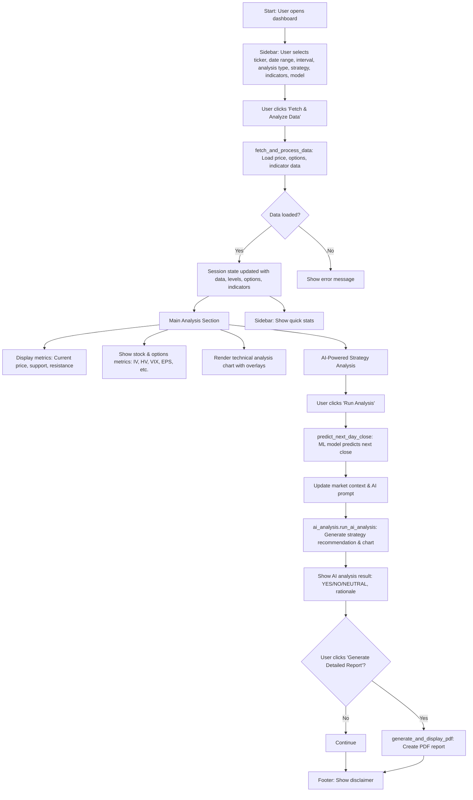

```mermaid
flowchart TD
    A[Start: User opens dashboard] --> B[Sidebar: User selects ticker, date range, interval, analysis type, strategy, indicators, model]
    B --> C[User clicks 'Fetch & Analyze Data']
    C --> D[fetch_and_process_data: Load price, options, indicator data]
    D --> E{Data loaded?}
    E -- Yes --> F[Session state updated with data, levels, options, indicators]
    E -- No --> G[Show error message]
    F --> H[Main Analysis Section]
    H --> I[Display metrics: Current price, support, resistance]
    H --> J[Show stock & options metrics: IV, HV, VIX, EPS, etc.]
    H --> K[Render technical analysis chart with overlays]
    H --> L[AI-Powered Strategy Analysis]
    L --> M[User clicks 'Run Analysis']
    M --> N[predict_next_day_close: ML model predicts next close]
    N --> O[Update market context & AI prompt]
    O --> P[ai_analysis.run_ai_analysis: Generate strategy recommendation & chart]
    P --> Q[Show AI analysis result: YES/NO/NEUTRAL, rationale]
    Q --> R{User clicks 'Generate Detailed Report'?}
    R -- Yes --> S[generate_and_display_pdf: Create PDF report]
    R -- No --> T[Continue]
    F --> U[Sidebar: Show quick stats]
    T --> V[Footer: Show disclaimer]
    S --> V
```